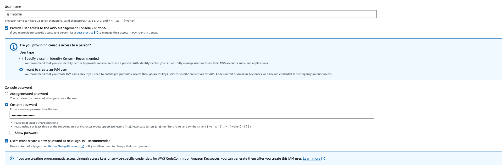
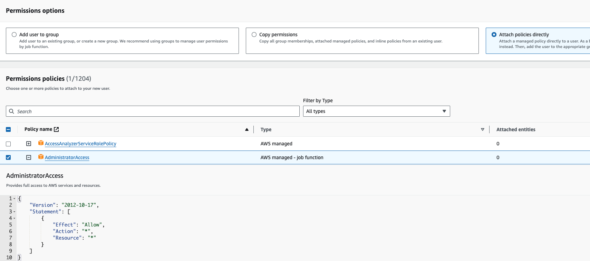
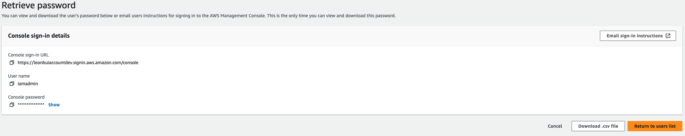
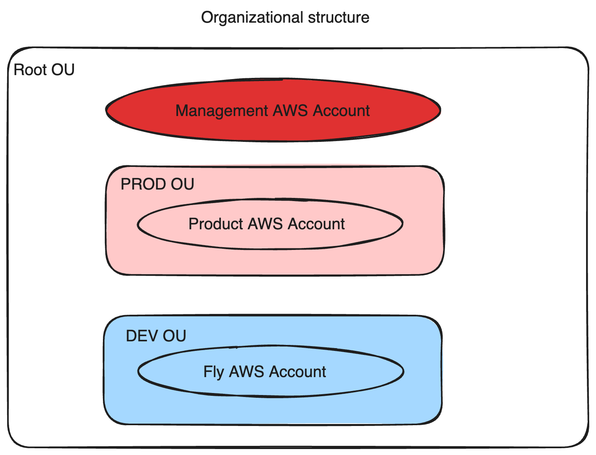
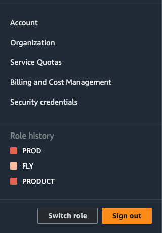

# AWS Account and AWS Organization

## What inside of this post?

- Explain about AWS Account and setup a account with MFA setup.
- Explain about AWS Organization and setup an Organization with a general account and a prod and fly(development) account. It will be like a real AWS Organization in a company.
- Explain about SCP and make an example demonstrates about it. Understand how an administrator managements permission of each AWS account in in a company.

## AWS Account

- AWS Account is not user
- AWS Account is a container for aws resources
- AWS Account need **_unique email_**, account name, credit card
- AWS Account have a account root user
- AWS account root user have **_all permissions_** in AWS account

### MFA

#### Why need MFA?

- Username and password. If it's leaked, anyone can login to your account
- That why we need more `factors`. It's different pieces of evidence which prove identity. `factor` appear in some term like: single-factor authentication, multi-factor authentication
  - Knowledge: one type of factor: something you know. Username and password is example of this factor type.
  - Possession: Something you have. Example is: bank card, MFA device. For example, in multi-factor authentication we need username and password and also a code from MFA device.
  - Inherent: Something you are: fingerprint, face, voice,etc
  - Location: a location, can be physically or network
  - More factors: something else
- Overall more factors means more security and harder to fake

#### Setup MFA

Setup MFA Follow:


- When you login to you account by username and password, AWS will generate a secret key and also get some additional information
- AWS generates a QR code from these information.
- User MFA authentication application to scan this QR code. It wil extract information from the QR code. and have a algorithm to generate a onetime code based on the received information.

### Setup AWS user

After create root user and setup MFA, and all the configuration, you need to setup user to use instead of using root account for some reasons:

- Can not restrict permissions of root users: include close account and manage subscriptions
- You need to create users for multiple users access to your account
- Anyway, it's best practice that AWS suggested

Now, let's create a admin user and use it instead of using root user:

- Fill username and password

  

- Select policy AdministratorAccess for user

  

- Review and create user

  

Allow iamadmin access to billing and cost information by configuring on _Account->IAM user and role access to Billing information->Activate IAM Access_

And then setup MFA for your new iamadmin user.

## AWS Organization

AWS Organization is a container of AWS accounts.
For example in a company, they can setup an AWS account as the administrator of all child accounts.
In this section, we will create a organization with following structure:



### Create new AWS Organization

#### Create dev and prod accounts inside organization

In AWS Organizations service page, click `Add an AWS Account` and fill all the information.
Organization's name should have substring like `prod` or `dev` for easy to recognize.
For me, i create `leonbuiaccountfly` for development and `leonbuiaccountprod` for production, and `leonbui_account` as the management account.

#### Create Organization Unit

In the Root of Organization, we can create Organization Unit.
Select the Root and create two OU: `DEV`, `PROD`

After that, you can select `leonbuiaccountfly` and `leonbuiaccountprod` and choose `Move` to move the the corresponding OU.
After that you can see latest result like this following image:


You can also setup for `Switch Role` on AWS Console. Just click to `Switch Role` and setup for all new account in the organization.



## Service Control Policies

- SCPs are account permissions boundaries. It define what an account(which attached with a SCP) can and can not do
- SCPs don't affect users or roles in the management account. They affect only the member accounts in your organization.
- Management account can not be effected by SCPs

### Make a SCP

First, you need to enable SCP. Click `Policies`->`Service Control Polices` and enable it.
After that, create a new SCP name `AllowAllExceptS3`. It's mean: can do anything except s3.
AllowAllExceptS3:

```json
{
  "Version": "2012-10-17",
  "Statement": [
    {
      "Effect": "Allow",
      "Action": "*",
      "Resource": "*"
    },
    {
      "Effect": "Deny",
      "Action": "s3:*",
      "Resource": "*"
    }
  ]
}
```

So after create it, new new SCP will appear in the list. But it will do not make any effect until you attach it to an account or OU.
