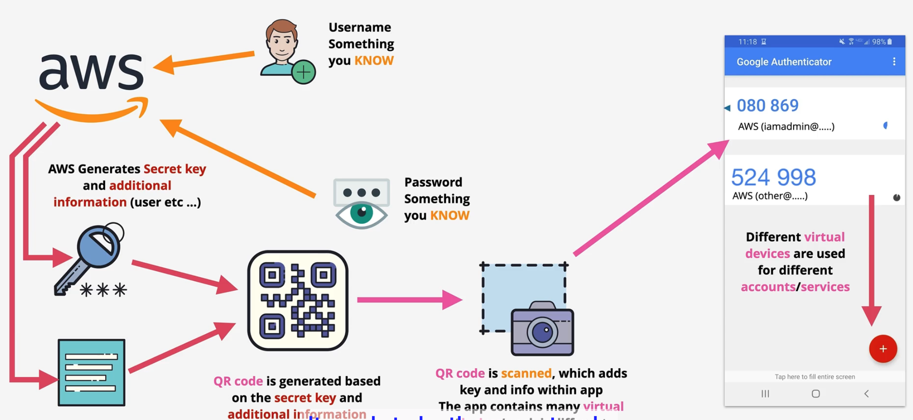

# Overview

- AWS Account is not user
- AWS Account is a container for aws resources
- AWS Account need **_unique email_**, account name, credit card
- AWS Account have a account root user
- AWS account root user have **_all permissions_** in AWS account

# MFA

## Why need MFA?

- Username and password. If it's leaked, anyone can login to your account
- That why we need more `factors`. It's diffrent pieces of envidence which prove identity. `factor` appear in some term like: single-factor authentication, multi-factor authentication
  - Knowledge: one type of factor: something you know. Username and password is example of this factor type.
  - Possession: Something you have. Example is: bank card, MFA device. For example, in multi-factor authentication we need username and password and also a code from MFA device.
  - Ingerent: Something you are: fingersprint, face, voice,etc
  - Location: a localtion, can be physically or network
  - More factors: something else
- Overall more factors means more security and harder to fake

## Setup MFA

Setup MFA Follow:

- When you login to you account by username and password, AWS will generate a secret key and also get some additional information
- AWS generates a QR code from these information.
- User MFA authentication application to scan this QR code. It wil extract information from the QR code. and have a algorithm to generate a onetime code based on the received information.
